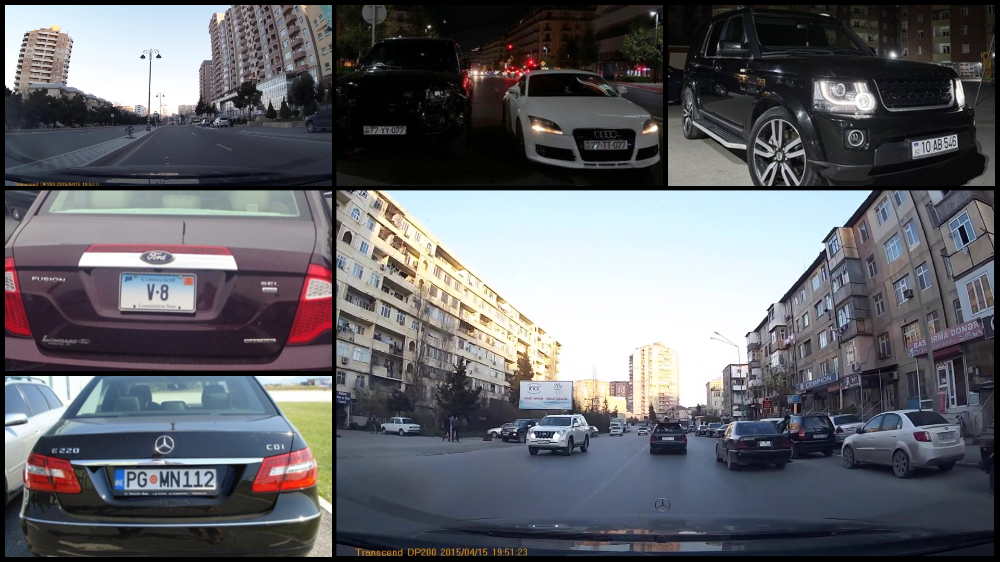
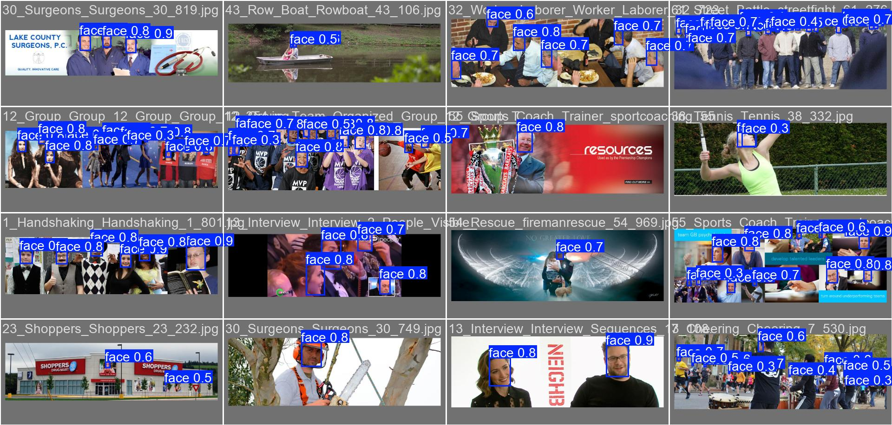
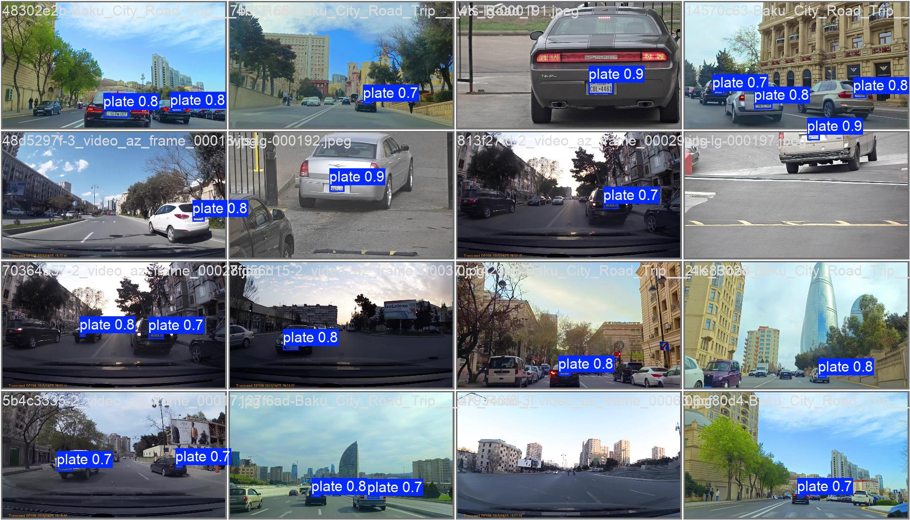
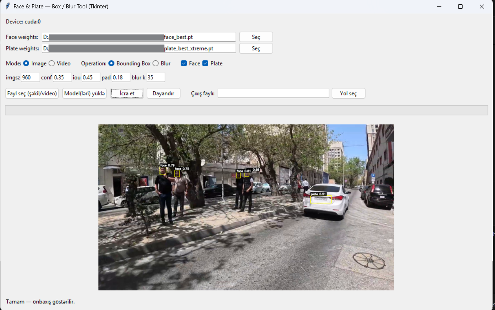

# Face & Plate Blur — Privacy-Preserving Computer Vision

An end-to-end pipeline to **detect and anonymize faces & license plates** in images/videos using **YOLOv8**, with a **desktop Tkinter app** and a batch **merged_blur.py** script. Trained on **WIDER FACE** (faces) and a **custom license-plate dataset** (5h dashcam frames + publicly available images). Final output applies **Gaussian Blur** on detected regions, with simple tracking for stable video anonymization.

[](https://colab.research.google.com/github/bahramzada/Face_Plate_Blur/blob/main/face_dataset_train.ipynb) (Face)

[](https://colab.research.google.com/github/bahramzada/Face_Plate_Blur/blob/main/plate_dataset_train.ipynb) (Plate)


---

<p align="center">
  
</p>

> *(Intro GIF — demo of the blur pipeline)*

---

## Overview

This project demonstrates a full privacy-preserving CV workflow:

- **Data**: WIDER FACE for faces, plus a **custom plate dataset** built from ~5 hours of dashcam footage and public images (scraped).
- **Training**: YOLOv8 (face/plate models trained separately) on **2× RTX 5090 (32 GB)** with AMP, cosine LR, and data augmentations.
- **Inference**: 
  - `merged_blur.py` for **batch video anonymization**.
  - `face_plate_tool.py` (**Tkinter UI**) for **interactive** image/video processing with **Bounding Box** or **Blur** modes.
- **Tracking**: lightweight IOU matching + EMA smoothing → **stable boxes** across frames.

---

## About Privacy-Preserving Vision

Unlike generic object detection, **privacy-preserving detection** must:
- **Minimize false negatives** (avoid missing PII like faces/plates).
- Remain robust to **tiny objects**, occlusions, motion blur, night scenes, etc.
- Support **stable anonymization** in videos (reduce flicker/pop-in).  
We address these via:
- Larger `imgsz` (e.g., 960–1024) for small objects,
- Carefully tuned **augmentations** and **cosine LR**,
- A simple **tracker with hysteresis** (keep weak detections briefly, EMA smoothing).

---

## Features

- ✨ **Two specialized detectors**: separate YOLOv8 models for **faces** and **plates**.
- ⚡ **Fast anonymization**: GPU-accelerated, with half-precision inference when available.
- 🛠️ **Interactive Tkinter app**: choose image/video, show **Bounding Boxes** or apply **Blur**, tune thresholds (`conf`, `iou`, `pad`, `imgsz`).
- 📈 **Stable video results**: IOU-based tracking + exponential moving average to reduce jitter.

---

## Dataset

### Faces
- **Source**: [WIDER FACE](http://shuoyang1213.me/WIDERFACE/)  
- **Size**: ~32k images, ~393k face boxes
- **Language**: N/A (vision)
- **Format**: Images + bounding boxes (converted to YOLO format)
- **Classes**: `face`
- **Preprocessing**: resize/augment (HSV, flip, rotate, translate, scale)

<p align="center">
  
</p>


### License Plates (Custom)
- **Source**: ~5 hours **dashcam frames** + scraped **public images**
- **Size**: *project-specific* (collected & labeled)
- **Language**: N/A (vision)
- **Format**: YOLO labels (from manual/VOC→YOLO conversions)
- **Classes**: `plate`
- **Preprocessing**: QA on annotations, outlier removal, small-object aware training

<p align="center">
  
</p>
---

## Model Details

*(Per detector — Face / Plate)*

- **Base Model**: YOLOv8 (face: `yolov8m`, plate: `yolov8l`)
- **Training Epochs**: 70 (face), 100 (plate)
- **Batch Size**: 24–32 (per GPU memory)
- **Input Size**: 960–1024
- **Learning Rate**: `lr0 ≈ 0.0025–0.003`, `lrf = 0.1`, **cosine LR**
- **Optimizer**: AdamW (`weight_decay ≈ 5e-4`)
- **Augmentations**: `hsv_h=0.015, hsv_s=0.6–0.7, hsv_v=0.4, degrees≈3–5, translate≈0.06–0.1, scale≈0.5, fliplr=0.5`
- **Hardware**: **2× RTX 5090 32 GB** (multi-GPU)
- **Checkpoints**: `runs/detect/.../weights/best.pt`
- **Metrics**: mAP/precision/recall reported per notebook (see CSV logs in repo)

---

## Requirements

```txt
ultralytics==8.3.204
opencv-python>=4.10.0
pillow>=10.4.0
numpy>=1.26
tqdm>=4.66.0
pyyaml>=6.0.1
psutil>=5.9.8

# Notebooks / EDA
pandas>=2.2.0
matplotlib>=3.8.0
jupyter>=1.0.0
ipykernel>=6.29.0

# Optional (scraping / utilities)
requests>=2.32.0
selenium>=4.24.0
webdriver-manager>=4.0.2
````

> **PyTorch** is CUDA-specific — install separately:
>
> * **CUDA 12.x**: `pip install --index-url https://download.pytorch.org/whl/cu121 torch torchvision torchaudio`
> * **CPU-only**: `pip install --index-url https://download.pytorch.org/whl/cpu torch torchvision torchaudio`

---

## Installation

1. Clone the repository:

```bash
git clone https://github.com/bahramzada/Face_Plate_Blur.git
cd Face_Plate_Blur
```

2. Install dependencies:

```bash
pip install -r requirements.txt
# then install torch for your CUDA/CPU as noted above
```

3. GPU support (optional):

```bash
# Example (CUDA 12.x)
pip install --index-url https://download.pytorch.org/whl/cu121 torch torchvision torchaudio
```

---

## Usage

### Using Google Colab (Recommended)

1. Click the badge at the top (face training notebook)
2. Run the notebook cells
3. Follow the step-by-step process (dataset prep → training → evaluation)

### Local Usage

1. Launch notebooks:

```bash
jupyter notebook face_dataset_train.ipynb
jupyter notebook plate_dataset_train.ipynb
```

2. Follow the cells to reproduce training/evaluation.

### Quick Example (Python API — predict & blur an image)

```python
from ultralytics import YOLO
import cv2

# Load detectors (paths to your trained weights)
face_model = YOLO("weights/face_best.pt")
plate_model = YOLO("weights/plate_best.pt")

img = cv2.imread("sample.jpg")
H, W = img.shape[:2]

# Predict
faces  = face_model(img, imgsz=960, conf=0.35, iou=0.45, verbose=False)[0].boxes.xyxy.cpu().numpy()
plates = plate_model(img, imgsz=1024, conf=0.35, iou=0.45, verbose=False)[0].boxes.xyxy.cpu().numpy()

# Blur regions (with padding)
def clamp(a,b,c): return max(a, min(b,c))
def pad_box(x1,y1,x2,y2,p=0.18):
    bw, bh = (x2-x1), (y2-y1)
    px, py = int(bw*p), int(bh*p)
    return clamp(x1-px,0,W-1), clamp(y1-py,0,H-1), clamp(x2+px,0,W-1), clamp(y2+py,0,H-1)

for box in list(faces) + list(plates):
    x1,y1,x2,y2 = map(int, box[:4])
    x1,y1,x2,y2 = pad_box(x1,y1,x2,y2,0.18)
    roi = img[y1:y2, x1:x2]
    img[y1:y2, x1:x2] = cv2.GaussianBlur(roi, (35,35), 0)

cv2.imwrite("sample_blurred.jpg", img)
```

### Batch Video Anonymization

```bash
# process all videos in a folder with both face+plate models
python merged_blur.py \
  --faces weights/face_best.pt \
  --plates weights/plate_best.pt \
  --in ./videos \
  --out ./blurred
```

*(If your script version doesn’t accept CLI flags, set paths at the top of `merged_blur.py` and run it.)*

### Desktop UI (Tkinter)

* Start the app:

```bash
python face_plate_tool.py
```

* Load **Face** / **Plate** weights
* Choose **Image** or **Video** mode
* Select **Bounding Box** or **Blur**, tune `conf/iou/imgsz/pad`
* Pick input file, (optionally) set output path, click **Run**

---

## Training Process

1. **Data Loading** — import WIDER FACE / custom plate images & labels (YOLO format).
2. **Preprocessing** — train/val split, QA on labels, small-object awareness (larger `imgsz`).
3. **Augmentation** — HSV shifts, flips, slight rotation/translate/scale.
4. **Model Training** — YOLOv8 (`yolov8m` for faces, `yolov8l` for plates), AdamW, cosine LR, AMP, multi-GPU.
5. **Evaluation** — mAP/precision/recall on val sets; qualitative inspection & saved predictions.

### Training Configuration (Python API sketch)

```python
from ultralytics import YOLO

# Faces
face = YOLO("yolov8m.pt")
face.train(
    data="assets/face_data.yaml",
    imgsz=960, epochs=70, batch=32, device="0,1",
    optimizer="AdamW", lr0=0.0025, lrf=0.1, weight_decay=0.0005,
    amp=True, cache=True, cos_lr=True,
    hsv_h=0.015, hsv_s=0.6, hsv_v=0.4, degrees=3.0,
    translate=0.06, scale=0.5, fliplr=0.5
)

# Plates
plate = YOLO("yolov8l.pt")
plate.train(
    data="assets/plate_data.yaml",
    imgsz=1024, epochs=100, batch=24, device="0,1",
    optimizer="AdamW", lr0=0.003, lrf=0.1, weight_decay=0.0005,
    amp=True, cache=True, cos_lr=True,
    hsv_h=0.015, hsv_s=0.7, hsv_v=0.4, degrees=5.0,
    translate=0.1, scale=0.5, fliplr=0.5
)
```

---

## File Structure

```
Face_Plate_Blur/
├── README.md
├── assets/
│   ├── introduce_gif.gif        # demo GIF
│   ├── face_val_pred.jpg        # face predictions (example)
│   ├── plate_val_pred.jpg       # plate predictions (example)
│   ├── face_data.yaml           # YOLO data config (faces)
│   ├── plate_data.yaml          # YOLO data config (plates)
│   └── app_ui.png               # Tkinter app screenshot
├── weights/
│   ├── face_best.pt
│   └── plate_best.pt
├── face_dataset_train.ipynb
├── plate_dataset_train.ipynb
├── merged_blur.py               # batch video anonymization
├── face_plate_tool.py           # Tkinter UI app
├── requirements.txt
└── .git/
```

---

## Results

* High-quality, small-object detection for **faces** and **plates** on diverse conditions.
* Stable video anonymization via **simple tracking + EMA** (reduced jitter/pop-in).
* Trained on **2× RTX 5090 32 GB**, enabling larger `imgsz` and robust augmentations.

**Examples**

**Face predictions**

<p align="center">
  
</p>

**Plate predictions**
<p align="center">
  
</p>

**App UI**
<p align="center">
  
</p>

**Configs**

* Face YAML: [https://github.com/bahramzada/Face_Plate_Blur/blob/main/assets/face_data.yaml](https://github.com/bahramzada/Face_Plate_Blur/blob/main/assets/face_data.yaml)
* Plate YAML: [https://github.com/bahramzada/Face_Plate_Blur/blob/main/assets/plate_data.yaml](https://github.com/bahramzada/Face_Plate_Blur/blob/main/assets/plate_data.yaml)

---

## Contributing

Contributions are welcome! Please open an **issue** or **PR**. Especially helpful:

* Bug fixes and performance tweaks (tracking, batching, mixed precision)
* Expanded datasets and labeling tools
* Additional anonymization modes (pixelation, mosaic, black boxes)

---

## License

This project is open-source. See the **LICENSE** file for details.

---

## Acknowledgments

* **WIDER FACE** dataset authors
* **Ultralytics YOLO** for training/inference tooling
* Open-source community for inspiration and utilities

---

## Citation

```bibtex
@misc{face_plate_blur,
  title  = {Face & Plate Blur — Privacy-Preserving Computer Vision},
  author = {Bahramzada, Raul},
  year   = {2025},
  url    = {https://github.com/bahramzada/Face_Plate_Blur}
}
```

---

*"Anonymize first; analyze later — privacy is a feature, not a trade-off."*

```
```
